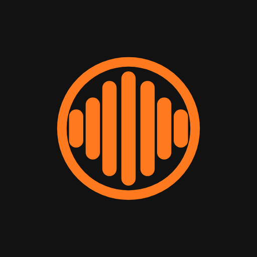
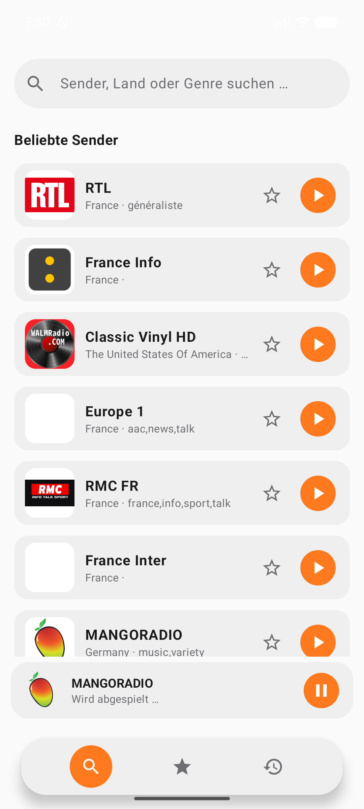
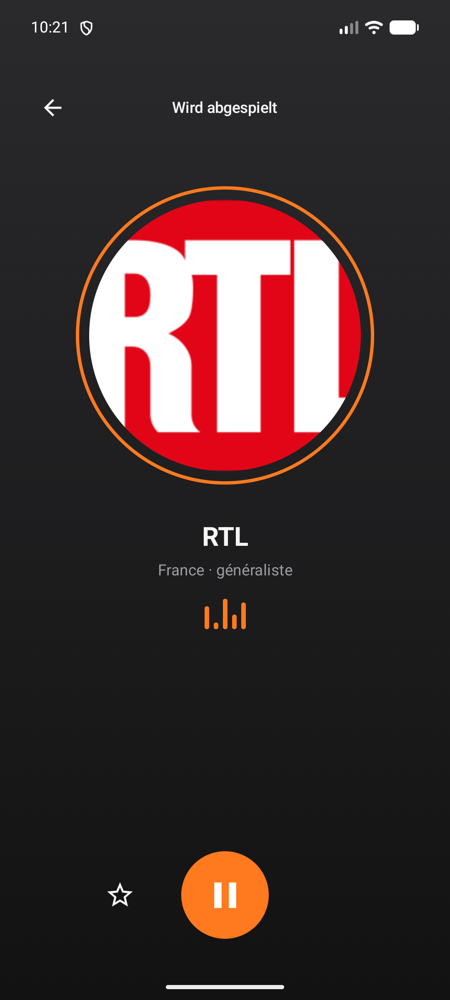
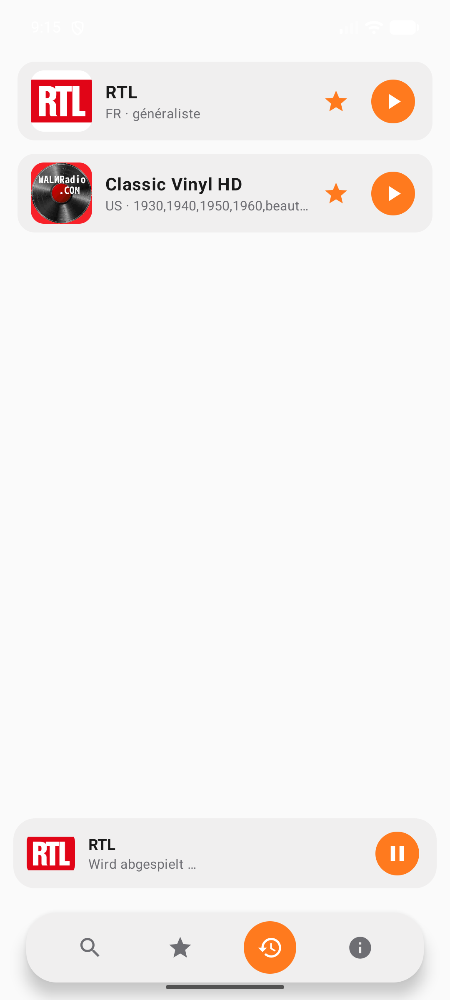
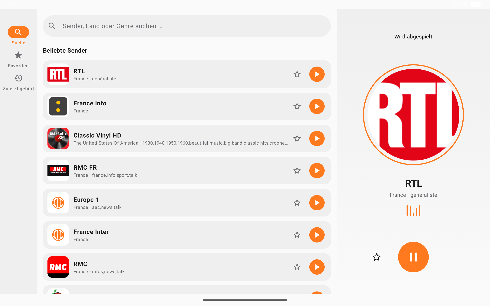

<div align="center">


# Frequenzia

**Internetradio hören, ohne Kompromisse.**

Über 50.000 Sender aus aller Welt entdecken und hören – schnell, werbefrei und ohne dass die App irgendetwas über dich wissen will.

[](https://github.com/ritt-itservice/frequenzia_app/releases/latest)
[](https://github.com/ritt-itservice/frequenzia_app/actions/workflows/android-ci.yml)
[](LICENSE)
[](#)
[](#kostenlos--werbefrei--privat)

[**⬇ Neueste Version herunterladen**](https://github.com/ritt-itservice/frequenzia_app/releases/latest)
&nbsp;·&nbsp;
[**▶ Google Play (geschlossener Test)**](https://play.google.com/store/apps/details?id=de.rittitservice.frequenzia)

</div>

<br>

<table>
<tr>
<td width="33%"></td>
<td width="33%"></td>
<td width="33%"></td>
</tr>
<tr>
<td align="center"><sub>Sendersuche mit Live-Ergebnissen</sub></td>
<td align="center"><sub>Vollbild-Player</sub></td>
<td align="center"><sub>Zuletzt gehört</sub></td>
</tr>
</table>

<table>
<tr>
<td width="100%"></td>
</tr>
<tr>
<td align="center"><sub>Eigenes Tablet-Layout: Navigationsleiste + dauerhaftes Player-Panel statt hochskalierter Handy-Ansicht</sub></td>
</tr>
</table>

## Was Frequenzia macht

- 🔍 **Sendersuche** nach Name, Land oder Genre/Tag – Ergebnisse aktualisieren sich automatisch während des Tippens
- ▶️ **Hintergrundwiedergabe** – läuft weiter bei gesperrtem Bildschirm, mit Steuerung über Benachrichtigung und Lockscreen
- ⭐ **Favoriten** lokal auf dem Gerät gespeichert
- 🕓 **Verlauf** der zuletzt wirklich gehörten Sender
- 🌐 Zugriff auf über 50.000 Sender weltweit via [Radio Browser API](https://www.radio-browser.info/)
- 🎧 Unterstützt gängige Streaming-Formate (HTTP/Progressive, HLS)
- 📱↔️📶 **Eigenes Tablet-Layout** (Navigationsleiste + Player-Panel) statt hochskalierter Handy-Ansicht
- 🔁 Merkt sich kurze Netzwerk-Aussetzer automatisch mit Wiederholungsversuch, statt gleich aufzugeben

## Kostenlos, werbefrei, privat

Frequenzia finanziert sich nicht über Werbung oder Nutzerdaten – und wird es auch nie tun.

- 💸 **Für immer kostenlos.** Kein Abo, kein Kauf, keine In-App-Käufe.
- 🚫 **Keine Werbung.** Nirgendwo in der App, jetzt und in Zukunft nicht.
- 🔒 **Keine Tracker, keine Analytics, keine Cloud-Bindung.** Was auf dem Gerät passiert, bleibt auf dem Gerät.
- ✅ **Keine invasiven Berechtigungen.** Kein Standort, keine Kontakte, kein Mikrofon, keine Kamera, kein Speicherzugriff. Angefragt wird nur, was für Streaming und Hintergrundwiedergabe technisch unumgänglich ist:

  | Berechtigung | Wofür |
  |---|---|
  | Internet | Sender laden und streamen |
  | Netzwerkstatus | Erkennen, ob eine Verbindung besteht |
  | Vordergrunddienst (Media Playback) | Wiedergabe läuft weiter, wenn die App im Hintergrund ist |
  | Benachrichtigungen | Wiedergabe-Steuerung in der Statusleiste/Lockscreen |
  | Wake Lock | Verhindert, dass die Wiedergabe beim Sperren des Bildschirms abreißt |

- 🔓 **100 % Open Source** (GPLv3) – der komplette Code ist hier einsehbar, nichts ist versteckt.

## Tech Stack

| Bereich | Verwendet |
|---|---|
| Sprache & UI | Kotlin, Jetpack Compose, Material 3 |
| Streaming | Media3 / ExoPlayer (inkl. HLS-Unterstützung) |
| Netzwerk | Retrofit + Gson gegen die [Radio Browser API](https://www.radio-browser.info/) |
| Lokale Daten | Room (Favoriten, Verlauf) |
| Bilder | Coil |
| Nebenläufigkeit | Kotlin Coroutines & Flow |
| Tests | JUnit + Robolectric (Migrations- und DAO-Tests) |
| CI | GitHub Actions (Lint, Tests, Release-Build bei jedem Push) |

## Installation

| Weg | Status |
|---|---|
| [**GitHub Releases**](https://github.com/ritt-itservice/frequenzia_app/releases/latest) | Signierte APK, sofort für alle nutzbar |
| [**Google Play**](https://play.google.com/store/apps/details?id=de.rittitservice.frequenzia) | Aktuell im geschlossenen Test – noch nicht öffentlich, aber schon unterwegs |

Zum Selbstbauen:

```bash
git clone https://github.com/ritt-itservice/frequenzia_app.git
cd frequenzia_app
gradle :app:assembleDebug
```

## Lizenz

Der **Quellcode** ist unter der [GNU General Public License v3.0](LICENSE) veröffentlicht – frei nutzbar, veränderbar und weiterverbreitbar.

**Ausgenommen davon sind das Frequenzia-Logo/App-Icon, die Feature-Grafik und die Screenshots** (u. a. in `docs/`). Diese dürfen nur im Zusammenhang mit dem originalen Frequenzia-Projekt verwendet werden – nicht für eigene Forks, Rebranding oder andere Projekte.
